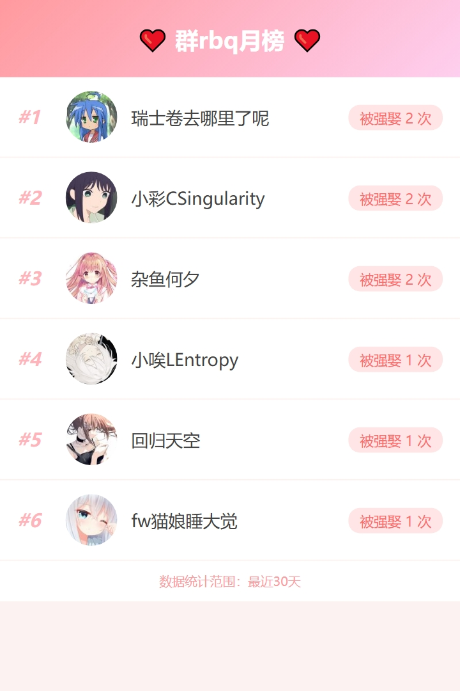

# 🌸 AstrBot 活跃成员抽老婆插件


基于 [AstrBot](https://github.com/Soulter/AstrBot) 的群聊互动插件。通过记录群内活跃成员（可配置天数内发言的用户），实现随机抽取“今日老婆”的功能，并生成群内成员间的羁绊关系图谱。

## ✨ 功能亮点

* **活跃筛选**：仅从指定天数内有发言记录的“活人”中抽取，自动过滤机器人与 ID 为 0 的异常账号。
* **快捷触发**：支持中文指令及 **英文缩写**（如 `jrlp`、`wdlp`），操作更高效。
* **头像展示**：抽取结果附带 640px 高清 QQ 头像，视觉体验更佳。
* **可视化关系**：基于 `Vis.js` 渲染生成高清关系网络图，直观展示群内“错综复杂”的老婆关系。
* **智能名称识别**：图谱自动关联用户昵称，优先显示群名片而非数字 ID。
* **QQ 官方机器人兼容**：从官方消息事件缓存昵称和头像，缺失头像时使用 AppID 与 member_openid 获取。
* **灵活管控**：支持 **群聊黑白名单**、每人每日抽取次数限制及强娶冷却时间设置。


## 🎮 使用指令

> [!IMPORTANT]
> **关于 @ 的使用：**
> 使用强娶并 @ 对方时，请**长按对方头像 @**，或输入@后点击输入框上方弹出的成员列表。不要手动输入 `@名字` 或复制黏贴文字，否则插件无法获取对方的 QQ 号导致功能失效。

> 在3.0.4及以前版本有在特定情况下群成员可以越权执行重置命令的bug，请尽快更新！

| 指令 | 英文缩写 | 其他别称 | 权限 | 说明 |
| --- | --- | --- | --- | --- |
| `/今日老婆` | `jrlp` | `抽老婆` | 用户 | 随机抽取一名今日老婆 |
| `/我的老婆` | `wdlp` | `抽取历史` | 用户 | 查看今天抽到的记录及剩余次数 |
| `/强娶 @用户` | `qiangqu` | - | 用户 | 消耗次数强制与指定用户建立羁绊 |
| `/关系图` | `gxt` | `羁绊图谱` | 用户 | 生成并发送本群今日的老婆关系网络图 |
| `/rbq排行` | `rbqph` | - | 用户 | 展示近30天被强娶的次数排行（前10名） |
| `/重置记录` | `czjl` | - | 管理员 | 清空所有今日抽取记录 |
| `/重置强娶时间` | `czqqsj` | - | 管理员 | 清空当前群所有人的强娶冷却 CD |
| `/重置求婚时间` | `czqhsj` | - | 管理员 | 清空当前群所有人的求婚冷却 CD |
| `/抽老婆帮助` | `clpbz` | `老婆插件帮助` | 用户 | 查看详细指令说明 |
| `/求婚 @用户` | `qh` | - | 用户 | 向群友发起求婚 |
| `/分手` | `fs` | - | 用户 | 解除普通老婆关系，强娶关系不可解除，每 72 小时可用一次 |
| `/挑选老婆` | `txlp` | - | 用户 | 从随机抽取的候选群友中选择一位成为今日老婆 |

求婚发起后，对方可在 30 秒内回复 `同意` 接受，或回复 `拒绝` 拒绝。若被拒绝，发起方可按机器人提示继续确认是否转入强娶流程。

发送 `/挑选老婆`（或 `txlp`）后，机器人会从活跃群友中随机抽取若干位候选（数量可配置，默认 3，最大 6），并以编号列表展示。选择编号即可

### 💡 关键词模式
若在配置中开启 `keyword_trigger_enabled`，则上述指令（包括英文缩写）均可**直接发送**（不带 `/` 前缀）触发。
* 示例：直接在群里发 `jrlp` 即可抽老婆。

## 🖼️ 功能演示




## 🛠️ 环境要求

本插件的关系图功能依赖于 AstrBot 的浏览器渲染引擎（环境一般astrbot自带，不用管）：

1. **Playwright**：请确保你的 AstrBot 环境已安装 `Playwright` 浏览器驱动（AstrBot 通常自带）。
2. **模板文件**：插件目录下需包含 `template/graph_template.html` 和 `template/rbq_ranking.html`。

## ⚙️ 配置项说明

在 AstrBot 管理面板或 _conf_schema.json 中可配置以下内容：

| 配置键 | 类型 | 默认值 | 说明 |
| --- | --- | --- | --- |
| `language` | string | `zh-CN` | 聊天回复语言，可选简体中文、English、日本語 |
| `daily_limit` | int | 1 | 每人每天可抽取的次数上限 |
| `force_marry_cd` | int | 3 | 强娶后的冷却天数 |
| `propose_cooldown_minutes` | int | 60 | 求婚成功后双方的冷却分钟数，设为 0 可关闭 |
| `max_records` | int | 500 | 活跃群友的最大记录数 |
| `active_user_days` | int | 30 | 活跃筛选天数，可设置 1 到 30 天 |
| `debug_enabled` | bool | false | 开启后输出抽取流程、候选池、群成员过滤、活跃池清理等调试日志 |
| `excluded_users` | list | [] | 永远不会被抽中的 QQ 号列表（用于“今日老婆”） |
| `force_marry_excluded_users` | list | [] | 强娶排除用户列表（在此列表中的 QQ 号不能被强娶） |
| `iterations` | int | 140 | 关系图生成迭代次数，头像跑出图片时可适当调小 |
| `keyword_trigger_enabled` | bool | false | 是否启用关键词触发（无需 `/` 前缀） |
| `keyword_trigger_mode` | string | exact | 匹配模式：`exact`(精确) / `starts_with`(开头) / `contains`(包含) |
| `auto_set_other_half` | bool | false | 自动设置对方老婆（对方当天无记录时生效） |
| `auto_withdraw_enabled` | bool | false | 定时自动撤回消息（仅 OneBot 协议可用） |
| `auto_withdraw_delay_seconds` | int | 5 | 自动撤回的延迟秒数 |
| `allow_marry_bot` | bool | false | 是否允许机器人进入老婆池并被抽取或强娶 |
| `at_waifu` | bool | false | 抽到老婆或强娶成功时是否额外 @ 对方 |
| `pick_candidate_count` | int | 3 | 挑选老婆的候选人数，最大 6，超过自动收敛 |
| `pick_retry_limit` | int | 2 | 每日最多展示的候选批数；初始挑选也计入，0 表示不限 |
| `whitelist_groups` | list | [] | 白名单群号列表 |
| `blacklist_groups` | list | [] | 黑名单群号列表 |

*也可以去看看[Nayukiiii](https://github.com/Nayukiiii)对这个插件的功能做出的一些有意思的改进[astrbot-plugin-wifepicker-edit](https://github.com/Nayukiiii/astrbot-plugin-wifepicker-edit)

觉得插件好用的话，就给个 star 吧 ❤️~

## 🗂️ 文件架构

```text
astrbot-plugin-wifepicker/
├── main.py                    # 插件入口、AstrBot 指令注册、关键词触发调度
├── keyword_trigger.py         # 无前缀关键词触发匹配器
├── onebot_api.py              # OneBot 消息撤回等平台能力封装
├── waifu_relations.py         # 自动设置对方老婆等关系记录辅助逻辑
├── _conf_schema.json          # AstrBot 管理面板配置项
├── metadata.yaml              # 插件元信息
├── CHANGELOG.md               # 更新记录
├── LICENSE                    # AGPL-3.0 许可证
├── src/
│   ├── constants.py           # 默认关键词路由表
│   ├── core.py                # 抽取、记录、冷却、清理等核心逻辑
│   ├── utils.py               # @ 目标解析、成员名解析、JSON 读写等工具函数
│   ├── user_profiles.py       # 用户昵称、头像与官方资料缓存
│   ├── debug.py               # 调试日志入口
│   ├── debug_utils.py         # 关系图调试数据生成工具
│   └── command/
│       ├── breakup.py         # /分手 与 72 小时冷却
│       ├── help.py            # /抽老婆帮助
│       ├── my_wife.py         # /我的老婆
│       ├── pick_wife.py       # /挑选老婆 与 重新挑选/放弃交互流程
│       ├── propose.py         # /求婚 与同意/拒绝交互流程
│       ├── rbqrank.py         # /rbq排行
│       ├── relationdiagram.py # /关系图
│       └── reset_propose_cd.py# /重置求婚时间
├── template/
│   ├── graph_template.html    # 关系图渲染模板
│   └── rbq_ranking.html       # rbq 排行渲染模板
└── pic/                       # README 演示图片
```

运行数据会写入 AstrBot 插件数据目录下的 `random_wife/`，常见文件包括 `wife_records.json`、`active_users.json`、`marriage_action_records.json`、`breakup_cooldowns.json` 和 `rbq_stats.json` 等。
